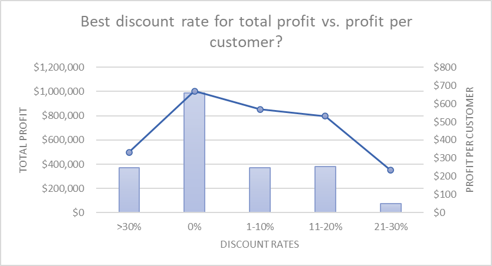
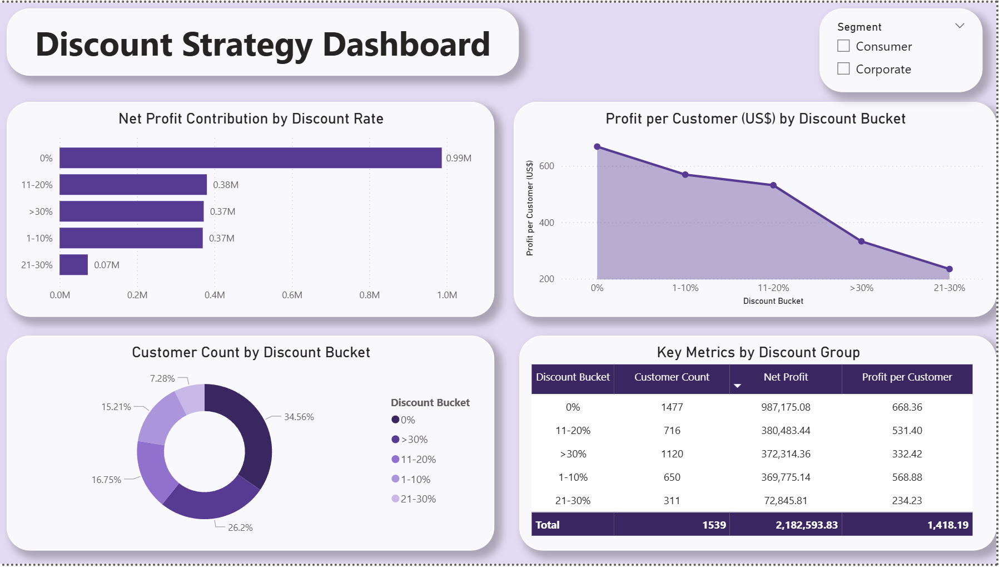

# Global Electronics Retail Profit & Loss Analysis (2019–2022): An End-to-End Analytics Project Using RFM Segmentation, Root Cause, and A/B Simulation

## Executive Summary 

Using SQL, Excel, and Power BI, this analysis evaluated key performance indicators for a global electronics retailer operating across 135 countries.

The company demonstrates healthy profitability across most product categories, with an overall profit margin of 9.0%. Revenue is heavily concentrated among two customer segments: Loyal (19.75% of customers) and Champions (10.85% of customers), which together account for 53.78% of total revenue.Despite strong top-line performance, several critical vulnerabilities emerged. Lost customers constitute over half of the customer base (55.36%), while new customers represent only 0.71% - indicating a failing acquisition pipeline. Additionally, the At Risk segment remains overlooked despite exhibiting average spending that is 63% higher than Lost customers.

Order-level analysis revealed that one in every four orders is unprofitable, generating total losses of $2.38 million - an amount exceeding half of the company's total profit. Losses are most concentrated in the Lenses, Speakers, and TV categories. The primary drivers are high overhead costs (54.53% of total losses), high-cost delivery (25.37%), and excessive discounts (19.65%).

Regarding discount strategy, a zero-discount policy is recommended as the corporate standard. However, category-specific exceptions apply: high discounts (20%+) improve both profit margin and repeat customer rates for Cameras and TVs. Accordingly, discounts exceeding 20% should be permitted exclusively for these two categories and eliminated across all others.

Based on these findings, the following recommendations are proposed: First, investigate overhead cost allocation methodology. Second, launch targeted acquisition campaigns for New customers and retention initiatives for At Risk, Cannot Lose, and Lost segments. Third, conduct detailed research on products and regions operating with negative profit margins. Finally, implement tighter cost controls during November, the highest-risk month for losses.

## Business Question for Data Analysis:

1. Where is the company making money and where is it losing money - across segments, regions, and product categories?
2. What is the full picture of losses of the company by different dimensions?
3. Which customer segments are driving our revenue, and where are the hidden weaknesses?
4. What are the main reasons business loses money on orders, and which cause is costing us the most?
5. We see high discounts hurting us in the loss analysis. But maybe high discounts drive more volume, more profit, or more loyal customers in certain categories. Should we eliminate high discounts entirely, or keep them where they work?

## Methodology

**SQL**: Extracted, cleaned, and transformed data (2019–2022). Performed RFM customer segmentation, root cause analysis on order-level losses, and observational discount analysis (A/B test simulation). Calculated time trends.

**Excel**: Built pivot tables with DAX measures, complex formulas, visualizations, data validation, and slicers to analyze KPIs, profit dashboard, losses, and discount impact.

**Power BI**: Designed interactive dashboards to visualize key findings.

## Skills 

**SQL**: CTEs, CASE WHEN, aggregations, window functions, JOINs, GROUP BY, HAVING, and date functions.

**Excel**: Power Pivot & DAX measures, pivot tables with slicers/timelines, complex formulas (XLOOKUP, SUMIFS, COUNTIFS, nested IFs), data validation, dashboards, and data visualizations.

**Power BI**: DAX (measures & calculated columns), ETL (Power Query), data visualization, and interactive dashboards.

## Results and Business Recommendations

### Question #1
During the studied period, the company generated total revenue of $24,303,592.50 and net profit of $2,182,593.83, resulting in an overall profit margin of 9.0%. The consumer segment is the primary source of profit, contributing 67.5% of total net profit. The corporate segment, while accounting for only 29.7% of revenue, delivers a higher profit margin (9.8% vs. 8.6%) and contributes the remaining 32.5% of net profit.

At the consumer level, the highest profit margins are observed in Canada (14.8%), followed by Southeast Asia (11.8%) and the East Region (10.0%). The weakest, yet still positive, consumer margins belong to West (5.2%), Central Asia (5.3%), and Africa (5.5%).

At the corporate level, profit margins are generally higher. The Caribbean region leads with 16.9%, followed by Central Asia (13.5%) and Oceania (12.8%). However, a notable exception is Corporate Canada, which shows a negative net profit of -$5,121.61 and a profit margin of - 13.5% - indicating a clear underperforming area requiring immediate attention. 

At the category level, the Camera category generates the highest revenue at $10,496,888.60, contributing the largest net profit ($910,202.02) with a profit margin of 8.67%. Within this category, Digital Cameras stand out as the most profitable sub-category, demonstrating a 12.7% profit margin on revenue of 3.59 million. The TV category follows closely with $8,307,164.80 in revenue and an overall profit of $811,982.46. Yet sub-category TV Accessories operates at a negative margin of -2.7%, resulting in a net loss of -$13,340.54. This underperforming line requires immediate action.
The Audio & HiFi category is the smallest of the three, generating $5,499,539.10 in revenue and $460,409.35 in net profit. The most concerning issue in this category is HiFi Accessories, which delivers only a 3.6% margin - significantly below the category average.

According to the preliminary analysis, the company's product portfolio demonstrates a generally healthy profitability across most categories. Yet the existence of specific loss-making areas (Corporate Canada, TV Accessories, HiFi Accessories) raises a natural next question: how bad are losses across the entire company, and where else do they hide? 

### Question #2
During the reviewed period, one out of every four orders was loss-making, generating total losses of $2,376,241.33. This figure actually exceeds half of the profit for the same period. 
Looking at product categories, Lenses account for the largest share of losses at nearly $500,000, followed by Speakers ($456,834) and TVs ($356,404). On a per-order basis, Digital Cameras are the most costly loss-makers, averaging a loss of $1,168 per order, followed by TVs ($950) and Camcorders ($818). Geographically, the United States leads in total losses ($539,867), with Australia and France trailing behind. However, the highest average loss per order occurs in smaller markets: Chad ($2,339), Papua New Guinea ($2,235), and Liberia ($2,202). Seasonally, losses spike in November, making it the riskiest month of the year.

### Question #3
53.78% of total revenue comes from two segments – Loyal (19.75% of customers) and Champions (10.85% of customers) – indicating heavy revenue concentration in these small customer groups. While the Lost segment represents over half of all customers (55.36%) and still contributes 32.17% of revenue, their average spend per customer is relatively low ($9176.76). Cannot Lose customers have the second-highest average spend ($30,412) but their small size (3.96% of customers) limits their revenue impact. Most critically, New Customers make up only 0.71% of the base, signaling failing customer acquisition, and the At Risk segment is being overlooked despite 63% higher average spend than Lost customers.

### Question #4
According to the analysis, the majority of losses, both in terms of number of orders (3,247) and lost profit (54.53%), appears to be caused by high overheads (including personnel, storage, and selling costs). This problem occurred in 16.22% of all orders. High-cost delivery takes 2nd place with 25.37% of losses and occurs in 4.32% of cases. The problem of high discount (average 51%) is also substantial (5.51% of cases), however less severe in terms of lost amount (19.65%).
To better understand the overheads problem, I examined "High Overheads" loss orders across order sizes. Overhead as a percentage of sales ranges from 98.5% (Large Orders) to 119.4% (Nano Orders) - meaning overhead costs alone exceed total sales revenue in nearly all of these loss orders. The small 21-point gap between the smallest and largest orders is unusual, as larger orders should benefit from economies of scale. This suggests either operational inefficiency or a flawed cost allocation methodology.

### Question #5	
While overheads and delivery costs account for the majority of losses, high discounts still represent a significant share - and unlike operational costs, discount policy can be adjusted immediately. This raises the question: should we eliminate high discounts entirely, or do they work in certain categories? 
A zero-discount policy appears to be the most profitable strategy overall, generating the highest total profit ($987,175) and the highest profit per customer ($668.36), while also maintaining the largest customer base. Moderate discounts (1-10% and 11-20%) perform reasonably well (profit per customer $568.88 and $531.40 respectively); however reach fewer customers and generate significantly lower total profit. Large discounts above 30% and 21-30% result in a dramatic drop in profit per customer ($332.42 and $234.23 respectively) and total profit ($372,314 and $72,845.81 respectively). Results suggest that deep discounts can erode profitability without generating sufficient volume to compensate, small to moderate discounts may be acceptable for specific occasions, yet the optimal approach is to avoid discounts altogether.

But the overall numbers don't tell the whole story. When I break down the impact of high versus low discounts by product category, a more nuanced picture emerges. For Audio & HiFi, low discounts result in a higher profit margin (6.60% vs. 5.57%) and a much stronger repeat customer rate (49.64% vs. 43.20%), suggesting that deep discounts hurt loyalty and profitability in this category. In contrast, the Camera category shows that high discounts, despite generating significantly lower total orders (2,965 vs. 5,963), lead to a higher margin (6.59% vs. 5.57%) and a substantially better repeat rate (33.46% vs. 21.97%), indicating that discounts can effectively drive customer loyalty here. The most striking result is for TVs: low discounts produce a negative gross margin (-0.35%), meaning those sales actually lose money, while high discounts result in a positive 3.27% margin and a significantly higher repeat rate (44.19% vs. 33.46%). 

## Recommendations 

**Loss-Making Areas**

-	Investigate root causes of losses in Corporate Canada (-13.5% profit margin) and TV Accessories (-2.7% profit margin), consider dropping service in these directions;
-	Review pricing and cost structure for low-margin products such as HiFi Accessories (3.6% margin); 
-	Invest in high-margin areas, including Digital Cameras, Consumer Canada, and Corporate Caribbean;
-	Enforce loss-prevention controls in November;
-	Review overhead cost allocation;

**Customer Segments**
-	Launch special promotions and targeted advertising to attract new customers and convert them into Promising or Loyal segments;
-	Provide exclusive VIP treatment (personalized offers/upgraded customer support/ early access to sales) to Cannot Lose customers to increase loyalty and move them into the Champions or Loyal segments;
-	Reach out to the Lost segment via phone calls and emails to understand why they stopped purchasing and revive their interest in the brand. Prioritize outreach to those with historically high monetary value first;
-	For Loyal and Champion Segment - Implement a loyalty program with exclusive benefits to maintain their engagement;

**Discount Strategy**
-	Eliminate discounts above 30% across all categories;
-	Adopt zero-discount as the default company strategy, while making targeted exceptions for Cameras and TVs; 
-	For Audio & HiFi, strictly avoid high discounts (20%+);
-	For TVs only, avoid low discounts (0–5%).

## Next Steps 
-	Deeper analysis of overhead allocation methodology
-	Validate category discount exceptions across dimensions
-	Deeper loss analysis for Lenses & Speakers
